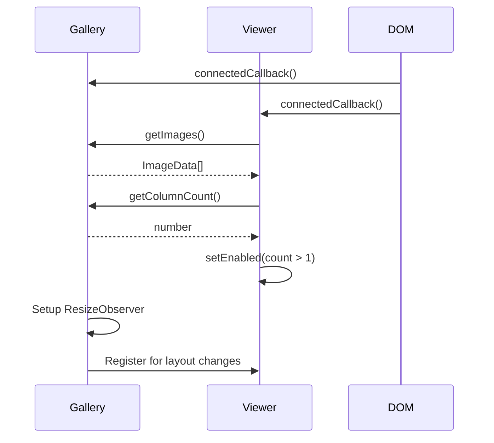
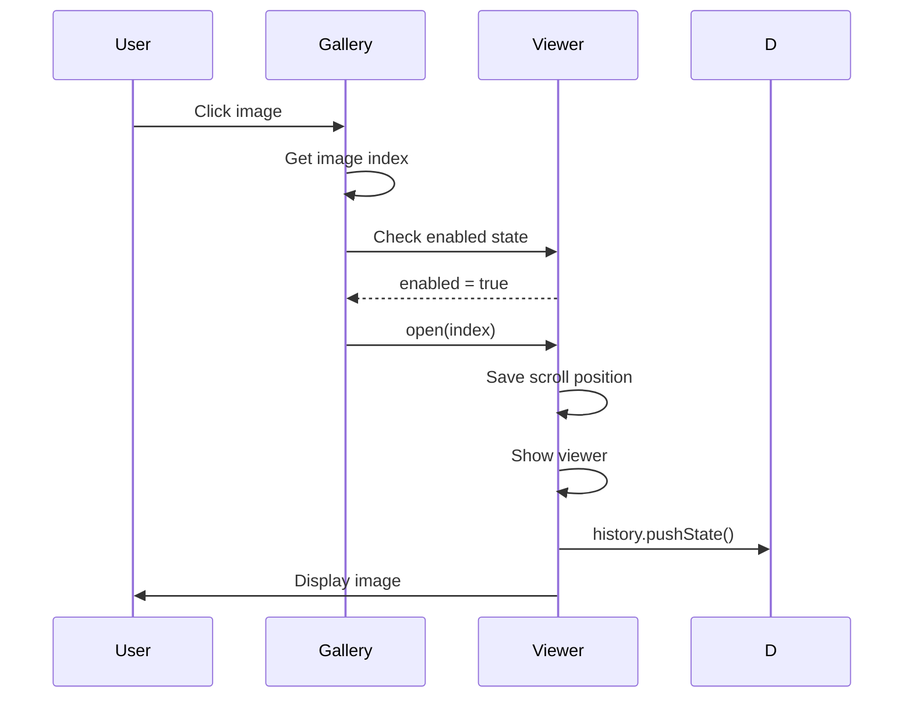
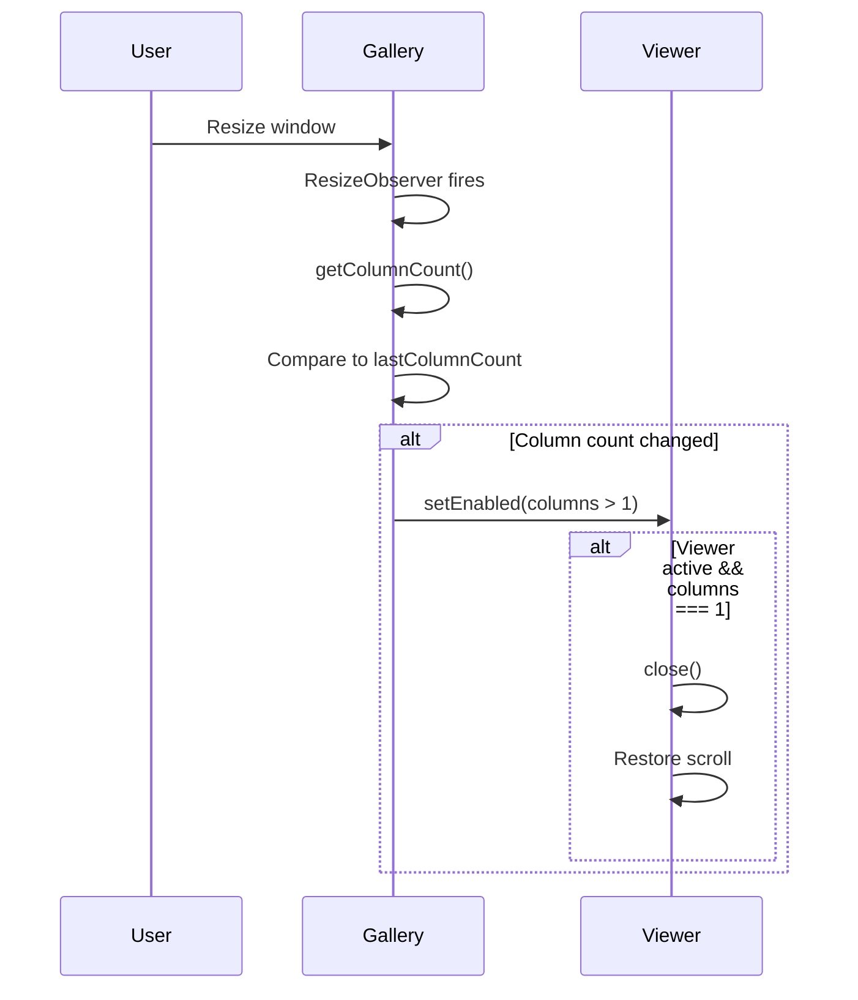

# Contract: Gallery Integration

**Feature**: 007-full-screen-image
**Type**: Integration Contract
**Version**: 1.0.0

## Overview
Contract defining how the masonry-gallery component integrates with image-viewer. Specifies the interface gallery must implement and the communication protocol between components.

---

## Gallery Responsibilities

### 1. Provide Image Data

**Contract**:
```typescript
GIVEN gallery contains images
WHEN viewer requests image data
THEN gallery MUST provide:
  - Array of ImageData objects in display order
  - Accurate index for each image (matches visual position)
  - Complete srcset for responsive images
  - Valid alt text for accessibility
  - Image dimensions for aspect ratio
```

**Implementation**:
```typescript
class MasonryGallery extends HTMLElement {
  getImages(): ImageData[] {
    const images = Array.from(this.querySelectorAll('.portfolio-image img'))
    return images.map((img, index) => ({
      id: img.dataset.id || `image-${index}`,
      src: img.src,
      srcset: img.srcset || '',
      webpSrc: img.dataset.webpSrc,
      webpSrcset: img.dataset.webpSrcset,
      alt: img.alt,
      width: parseInt(img.getAttribute('width') || '0', 10),
      height: parseInt(img.getAttribute('height') || '0', 10),
      index
    }))
  }
}
```

**Validation**:
- Array length MUST match visible image count
- Indices MUST be sequential (0, 1, 2, ...)
- No duplicate IDs allowed

---

### 2. Report Column Count

**Contract**:
```typescript
GIVEN gallery layout may change (resize, orientation)
WHEN viewer needs to determine enabled state
THEN gallery MUST report:
  - Current CSS Grid column count
  - Updated count whenever layout changes
```

**Implementation**:
```typescript
class MasonryGallery extends HTMLElement {
  getColumnCount(): number {
    const columns = window.getComputedStyle(this)
      .getPropertyValue('grid-template-columns')
      .split(' ')
      .filter(col => col !== 'auto')
      .length

    return columns
  }
}
```

**Validation**:
- Return value MUST be integer >= 1
- MUST reflect current computed CSS, not cached value
- MUST update on window resize

---

### 3. Register Image Click Handler

**Contract**:
```typescript
GIVEN viewer needs to activate on image click
WHEN gallery receives click on image
THEN gallery MUST:
  - Determine clicked image index
  - Call viewer.open(index) if viewer enabled
  - NOT call viewer if disabled (1 column layout)
```

**Implementation**:
```typescript
class MasonryGallery extends HTMLElement {
  private viewer: ImageViewerElement | null = null

  connectedCallback() {
    this.viewer = document.querySelector('image-viewer')

    this.addEventListener('click', (e) => {
      const target = e.target as HTMLElement
      const img = target.closest('.portfolio-image img')

      if (!img) return

      const images = this.getImages()
      const index = images.findIndex(image =>
        image.id === img.dataset.id
      )

      if (index >= 0 && this.viewer?.getState().enabled) {
        this.viewer.open(index)
      }
    })
  }
}
```

**Error Handling**:
- Image not found: Log warning, no-op
- Viewer not initialized: Log error, no-op
- Viewer disabled: No-op (expected in mobile)

---

### 4. Monitor Layout Changes

**Contract**:
```typescript
GIVEN gallery layout can change (resize, zoom)
WHEN column count changes
THEN gallery MUST:
  - Detect column count change via ResizeObserver
  - Call viewer.setEnabled(columns > 1)
  - Update immediately (not throttled/debounced)
```

**Implementation**:
```typescript
class MasonryGallery extends HTMLElement {
  private resizeObserver: ResizeObserver | null = null
  private lastColumnCount: number = 0

  connectedCallback() {
    this.resizeObserver = new ResizeObserver(() => {
      const columns = this.getColumnCount()

      if (columns !== this.lastColumnCount) {
        this.lastColumnCount = columns
        this.viewer?.setEnabled(columns > 1)
      }
    })

    this.resizeObserver.observe(this)
  }

  disconnectedCallback() {
    this.resizeObserver?.disconnect()
  }
}
```

**Performance**:
- ResizeObserver callback MUST check for actual change (avoid redundant calls)
- MUST NOT throttle/debounce (immediate response required for auto-close)

---

## Viewer Responsibilities

### 1. Initialize from Gallery Data

**Contract**:
```typescript
GIVEN viewer is added to DOM
WHEN connectedCallback fires
THEN viewer MUST:
  - Query for parent/sibling gallery component
  - Call gallery.getImages() to populate image list
  - Set initial enabled state based on gallery.getColumnCount()
  - Register for gallery layout changes
```

**Implementation**:
```typescript
class ImageViewer extends HTMLElement {
  private gallery: MasonryGallery | null = null
  private images: ImageData[] = []

  connectedCallback() {
    this.gallery = document.querySelector('masonry-gallery')

    if (!this.gallery) {
      console.error('ImageViewer: No gallery found')
      return
    }

    this.images = this.gallery.getImages()
    this.setEnabled(this.gallery.getColumnCount() > 1)
  }
}
```

**Error Handling**:
- Gallery not found: Log error, viewer stays disabled
- Empty image array: Log warning, viewer stays disabled
- Invalid image data: Filter out invalid entries, log warnings

---

### 2. Respect Gallery Scroll Position

**Contract**:
```typescript
GIVEN user is browsing gallery at scroll position Y
WHEN viewer opens
THEN viewer MUST:
  - Save current window.scrollY to localStorage
  - Prevent page scrolling (overflow: hidden on body)

WHEN viewer closes
THEN viewer MUST:
  - Restore exact scroll position (instant, no smooth scroll)
  - Re-enable page scrolling (remove overflow: hidden)
  - Clear saved scroll position from localStorage
```

**Implementation**:
```typescript
class ImageViewer extends HTMLElement {
  open(index: number) {
    // Save scroll position
    localStorage.setItem('gallery-scroll', String(window.scrollY))
    document.body.style.overflow = 'hidden'

    // ... rest of open logic
  }

  close() {
    // Restore scroll position
    const scrollY = parseInt(
      localStorage.getItem('gallery-scroll') || '0',
      10
    )

    document.body.style.overflow = ''
    window.scrollTo({ top: scrollY, behavior: 'instant' })
    localStorage.removeItem('gallery-scroll')

    // ... rest of close logic
  }
}
```

**Edge Cases**:
- Page height changed while viewer open: Clamp to new max scroll
- Rapid open/close: Latest scroll position wins
- Browser refresh during viewer: Check for saved position on load

---

### 3. Handle Image Load Failures

**Contract**:
```typescript
GIVEN viewer is displaying image at index N
WHEN image fails to load (404, network error, corrupt)
THEN viewer MUST:
  - Listen for 'error' event on  element
  - Automatically navigate to next image (N+1)
  - If at last image, navigate to previous (N-1)
  - If all images fail, close viewer
  - Dispatch 'viewer:error' event with index and error
```

**Implementation**:
```typescript
class ImageViewer extends HTMLElement {
  private setupImageErrorHandling(img: HTMLImageElement, index: number) {
    img.addEventListener('error', () => {
      this.dispatchEvent(new CustomEvent('viewer:error', {
        detail: { index, error: new Error('Image failed to load') }
      }))

      if (index < this.images.length - 1) {
        this.next()
      } else if (index > 0) {
        this.prev()
      } else {
        this.close()
      }
    })
  }
}
```

**Error Recovery**:
- Chain auto-skip if multiple images fail in sequence
- Log errors but don't show error UI (graceful degradation)
- Gallery's original images remain unchanged (viewer only)

---

## Communication Protocol

### Initialization Sequence



### Open Viewer Sequence



### Resize Sequence



---

## Data Flow Contract

### Image Data Flow
```
Gallery DOM → getImages() → ImageData[] → Viewer State → Display
```

**Validation Points**:
1. Gallery DOM: Images exist with required attributes
2. getImages(): Transform to valid ImageData format
3. ImageData[]: Validate each object (type guards)
4. Viewer State: Store in component state
5. Display: Render with srcset, alt, dimensions

### State Synchronization
```
Gallery Column Count → ResizeObserver → setEnabled() → Viewer Enabled State
```

**Update Frequency**:
- ResizeObserver: Immediate (no throttle)
- setEnabled(): Synchronous state update
- Auto-close: Immediate if count changes to 1

---

## CSS Integration Contract

### Gallery CSS Requirements

```css
/* Gallery MUST define column count via CSS Grid */
.masonry-gallery {
  display: grid;
  grid-template-columns: 1fr; /* Mobile: 1 column */
}

@media (min-width: 768px) {
  .masonry-gallery {
    grid-template-columns: repeat(3, 1fr); /* Tablet: 3 columns */
  }
}

@media (min-width: 1200px) {
  .masonry-gallery {
    grid-template-columns: repeat(4, 1fr); /* Desktop: 4+ columns */
  }
}
```

**Contract**:
- Column count MUST be determinable via `getComputedStyle`
- Media queries MUST match viewer's breakpoints (768px, 1200px)
- Grid MUST be direct layout method (not nested grids)

### Viewer CSS Requirements

```css
/* Viewer MUST overlay entire viewport when active */
image-viewer[data-state="active"] {
  position: fixed;
  inset: 0;
  z-index: 100; /* Above gallery (z-index: auto) */
}

/* Viewer MUST be hidden when inactive */
image-viewer[data-state="inactive"] {
  display: none;
}
```

**Contract**:
- Viewer MUST NOT interfere with gallery layout when inactive
- Viewer MUST cover gallery completely when active
- Z-index MUST be higher than all page content

---

## Performance Contract

### Gallery Responsibilities
- `getImages()`: MUST complete in < 50ms (even with 100+ images)
- `getColumnCount()`: MUST complete in < 5ms (synchronous CSS read)
- Click handler: MUST determine index in < 10ms

### Viewer Responsibilities
- `open()`: MUST start transition within 16ms (60fps)
- `close()`: MUST restore scroll within 16ms
- Image preload: MUST initiate within 200ms

### Integration Performance
- Gallery → Viewer communication: < 5ms overhead
- ResizeObserver callback: < 10ms execution time
- Total open sequence: < 50ms from click to first frame

---

## Testing Contract

### Gallery Integration Tests
1. Gallery provides valid ImageData array
2. Gallery reports correct column count at each breakpoint
3. Gallery calls viewer.open() on image click (when enabled)
4. Gallery does NOT call viewer.open() when disabled (mobile)
5. Gallery updates viewer.setEnabled() on resize

### Viewer Integration Tests
6. Viewer queries gallery for images on init
7. Viewer respects gallery column count for enabled state
8. Viewer saves/restores gallery scroll position
9. Viewer closes automatically when gallery resizes to 1 column
10. Viewer handles image load failures from gallery srcset

### End-to-End Integration Tests
11. Click gallery image → viewer opens at correct index
12. Resize desktop → mobile → viewer closes and scroll restores
13. Navigate in viewer → close → return to exact gallery position
14. Gallery image fails → viewer skips to next available
15. Multiple rapid clicks → only one viewer instance opens

---

## Error Handling Contract

### Gallery Errors
- **No images found**: Gallery returns empty array, viewer stays disabled
- **Invalid image data**: Gallery filters out invalid entries, logs warnings
- **Column count calculation fails**: Default to 1 column (safe mode)

### Viewer Errors
- **Gallery not found**: Viewer logs error, stays disabled, no crash
- **Invalid index from gallery**: Viewer clamps to valid range, logs warning
- **Image load failure**: Viewer auto-skips, dispatches error event

### Integration Errors
- **Viewer not initialized**: Gallery logs error, click is no-op
- **ResizeObserver fails**: Log error, viewer stays in last known state
- **History API fails**: Log warning, viewer still opens (without back button support)

---

## Version History

**v1.0.0** (2025-10-02): Initial integration contract
- Gallery responsibilities defined (4 required methods)
- Viewer responsibilities defined (3 integration points)
- Communication protocol specified
- Performance constraints established
